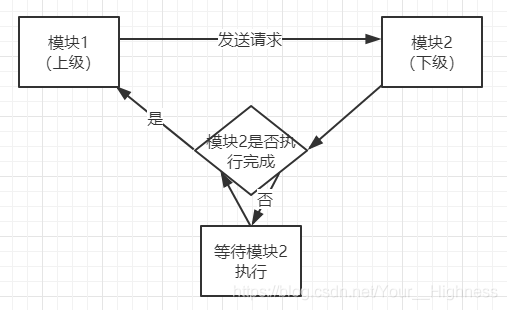
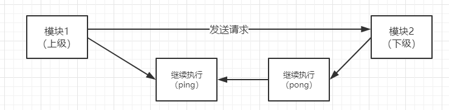

= 集群

== Cluster 集群模式（Redis官方）

Redis Cluster是一种服务器 Sharding 技术，3.0版本开始正式提供。

Redis 的哨兵模式基本已经可以实现高可用，读写分离 ，但是在这种模式下每台 Redis 服务器都存储相同的数据，很浪费内存，所以在 redis3.0上加入了 Cluster 集群模式，实现了 Redis 的分布式存储，也就是说每台 Redis 节点上存储不同的内容。

Redis 集群没有使用一致性 hash，而是引入了哈希槽【hash slot】的概念。

Redis 集群有 16384 个哈希槽，每个 key 通过 CRC16 校验后对 16384 取模来决定放置哪个槽。集群的每个节点负责一部分hash槽，举个例子，比如当前集群有3个节点，那么：

. 节点 A 包含 0 到 5460 号哈希槽
. 节点 B 包含 5461 到 10922 号哈希槽
. 节点 C 包含 10923 到 16383 号哈希槽

在 Redis 的每一个节点上，都有这么两个东西，一个是插槽（slot），它的的取值范围是：0-16383。还有一个就是 cluster，可以理解为是一个集群管理的插件。当我们的存取的 Key到达的时候，Redis 会根据 CRC16 的算法得出一个结果，然后把结果对 16384 求余数，这样每个 key 都会对应一个编号在 0-16383 之间的哈希槽，通过这个值，去找到对应的插槽所对应的节点，然后直接自动跳转到这个对应的节点上进行存取操作。

至少要 3 台以上的master节点，最好使用 3 主 3 从六个节点的模式。

优点

. 所有的 redis 节点彼此互联(PING-PONG机制)，内部使用二进制协议优化传输速度和带宽。
. 节点的 fail 是通过集群中超过半数的节点检测失效时才生效。
. 客户端与 Redis 节点直连，不需要中间代理层.客户端不需要连接集群所有节点，连接集群中任何一个可用节点即可。

PING-PONG机制：心跳监测

普通： A -> PING -> B -> DO SOMETHING -> A，A must wait

PING-PONG：是一种数据交换机制，我们可以不去等待接受模块（下级）处理结束，而是发送模块（上级）继续执行并将结果保存在ping路的缓存中，上级继续执行到一定时刻，下级模块处理完成将结果保存在pong路中），这样可以下级模块无需等待继续执行，上级也无需等待继续执行，转而将结果存储在ping路。这样便提高了处理效率。

== 哨兵模式

哨兵是一个独立的进程，作为进程，它会独立运行。其原理是哨兵通过发送命令，等待Redis服务器响应，从而监控运行的多个 Redis 实例。

作用

. 通过发送命令，让 Redis 服务器返回监控其运行状态，包括主服务器和从服务器；
. 当哨兵监测到 master 宕机，会自动将 slave 切换成 master ，然后通过发布订阅模式通知其他的从服务器，修改配置文件，让它们切换主机；

可以有多个哨兵，互相监测

过程

. 假设主服务器宕机，哨兵1先检测到这个结果，系统并不会马上进行 failover 过程，仅仅是哨兵1主观的认为主服务器不可用，这个现象成为主观下线。
. 当后面的哨兵也检测到主服务器不可用，并且数量达到一定值时，那么哨兵之间就会进行一次投票，投票的结果由一个哨兵发起，进行 failover 操作。
. 切换成功后，就会通过发布订阅模式，让各个哨兵把自己监控的从服务器实现切换主机，这个过程称为客观下线。

每秒一次

优点：

. 哨兵模式是基于主从模式的，所有主从的优点，哨兵模式都具有。
. 主从可以自动切换，系统更健壮，可用性更高(可以看作自动版的主从复制)。

缺点：

. Redis较难支持在线扩容，在集群容量达到上限时在线扩容会变得很复杂。

== 读写分离

优点：

. 读写分离，分担压力

缺点

. edis不具备自动容错和恢复功能，主机从机的宕机都会导致前端部分读写请求失败，需要等待机器重启或者手动切换前端的IP才能恢复（也就是要人工介入）；
. 机宕机，宕机前有部分数据未能及时同步到从机，切换IP后还会引入数据不一致的问题，降低了系统的可用性；
. 果多个 Slave 断线了，需要重启的时候，尽量不要在同一时间段进行重启。因为只要 Slave 启动，就会发送sync 请求和主机全量同步，当多个 Slave 重启的时候，可能会导致 Master IO 剧增从而宕机。
. edis 较难支持在线扩容，在集群容量达到上限时在线扩容会变得很复杂；
